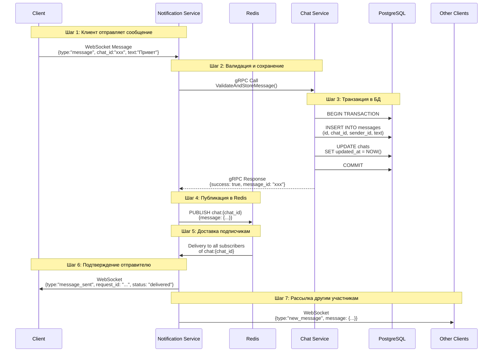

# NeonChat - Бэкенд Мессенджера

## Общая информация

**Название проекта:** NeonChat Backend System

**Задача:** Создать быстрый и надёжный бэкенд для мессенджера с поддержкой чата в реальном времени. В начале сделаем всё в одном сервисе (монолит), потом разделим на несколько микросервисов.

**Технологии:** Go, gRPC, WebSocket, Redis, PostgreSQL

**Сроки:** примерно 4-6 недель

**Что получится в итоге:**
- Рабочая система с функцией отправки и получения сообщений
- Чистый, протестированный код
- Docker конфигурация для запуска
- Документация с примерами
- Видео с демонстрацией

---

## Архитектура

План простой: сначала всё в одном сервисе, потом разделим.

### Фаза 1: Монолит (Недели 1-2)
```
┌─────────────────────────────────────────────────────┐
│                    MONOLITH SERVICE                 │
│  ┌─────────────┐  ┌─────────────┐  ┌─────────────┐  │
│  │  REST API   │  │ WebSocket   │  │   gRPC      │  │
│  │   Handler   │  │   Server    │  │   Server    │  │
│  └──────┬──────┘  └──────┬──────┘  └──────┬──────┘  │
│         │                │                │         │
│  ┌──────▼──────┐  ┌──────▼──────┐  ┌──────▼──────┐  │
│  │   Service   │◄─┤   Service   │  │   Service   │  │
│  │    Layer    │  │    Layer    │  │    Layer    │  │
│  └──────┬──────┘  └──────┬──────┘  └──────┬──────┘  │
│         │                │                │         │
│  ┌──────▼─────────────────────────────────▼──────┐  │
│  │           Repository Layer                    │  │
│  └──────┬─────────────────────────────────┬──────┘  │
│         │                                 │         │
└─────────┼─────────────────────────────────┼─────────┘
          │                                 │
    ┌─────▼─────┐                     ┌─────▼─────┐
    │PostgreSQL │                     │   Redis   │
    │   :5432   │                     │   :6379   │
    └───────────┘                     └───────────┘
```

**Цель фазы 1:** Быстро получить работающий прототип со всей функциональностью в одном сервисе. Это позволит:
- Быстро итерировать и тестировать идеи
- Минимизировать сложность на начальном этапе
- Сфокусироваться на бизнес-логике
- Создать работающий MVP за 2 недели

#### **Фаза 2: Микросервисы (Недели 3-4)**
```
┌─────────────────┐      HTTP/REST       ┌─────────────────┐
│   Chat Service  │◄────────────────────►│     Клиенты     │
│     (:8080)     │                      │  (UI, Console)  │
└────────┬────────┘                      └─────────────────┘
         │                                        │
         │ gRPC (protobuf)                 WebSocket
         │                                        │
┌────────▼────────┐                      ┌────────▼────────┐
│ Notification    │                      │ Notification    │
│   Service       │◄────────────────────►│   Service       │
│    (:8081)      │     WebSocket        │   (:8081) WS    │
└────────┬────────┘                      └─────────────────┘
         │
         │ Redis Pub/Sub
         │
┌────────▼────────┐
│     Redis       │
│   (:6379)       │
│  • Pub/Sub      │
│  • Online Cache │
└─────────────────┘
      │
┌─────▼─────┐
│PostgreSQL │
│  (:5432)  │
└───────────┘
```

**Цель фазы 2:** Рефакторинг монолита в микросервисную архитектуру:
- Разделение ответственности
- Независимое масштабирование компонентов
- Внедрение gRPC для межсервисного взаимодействия
- Улучшение отказоустойчивости

### **2.2. Компоненты системы**

#### **2.2.1. Chat Service (Основной сервис)**
**Порт:** 8080
**Ответственность:**
- Управление пользователями (регистрация, аутентификация)
- Управление чатами (создание, список)
- История сообщений
- Бизнес-логика приложения
- REST API для клиентов

**Технологии:** Go, PostgreSQL, JWT, Swagger

#### **2.2.2. Notification Service (Сервис уведомлений)**
**Порт:** 8081 (HTTP), 8082 (WebSocket)
**Ответственность:**
- WebSocket соединения с клиентами
- Управление онлайн-статусами
- Рассылка сообщений в реальном времени
- Кэширование активных соединений

**Технологии:** Go, Redis (Pub/Sub + Cache), WebSocket

### **2.3. Протоколы взаимодействия**

| Протокол | Назначение | Между кем | Порт |
|----------|------------|-----------|------|
| HTTP/REST | API для управления данными | Клиент ↔ Chat Service | 8080 |
| WebSocket | Реальный времени обмен сообщениями | Клиент ↔ Notification Service | 8082 |
| gRPC | Межсервисное взаимодействие | Chat Service ↔ Notification Service | 8081 |
| PostgreSQL | Хранение данных | Chat Service ↔ DB | 5432 |
| Redis Pub/Sub | Рассылка сообщений | Notification Service ↔ Redis | 6379 |

---

## **3. ФУНКЦИОНАЛЬНЫЕ ТРЕБОВАНИЯ**

### **3.1. Модуль аутентификации и авторизации**

#### **3.1.1. Регистрация пользователя**
**Эндпоинт:** `POST /api/v1/auth/register`
**Тело запроса:**
```json
{
  "username": "string, 3-50 символов, уникальный",
  "password": "string, мин. 6 символов"
}
```

**Валидация:**
- Проверка уникальности username
- Проверка сложности пароля
- Хэширование пароля с использованием bcrypt

**Ответ:**
```json
{
  "id": "uuid-v4",
  "username": "string",
  "created_at": "timestamp"
}
```

#### **3.1.2. Аутентификация пользователя**
**Эндпоинт:** `POST /api/v1/auth/login`
**Тело запроса:**
```json
{
  "username": "string",
  "password": "string"
}
```

**Ответ (успех):**
```json
{
  "token": "JWT токен",
  "expires_in": 86400,
  "user": {
    "id": "uuid",
    "username": "string"
  }
}
```

**Спецификация JWT токена:**
```json
{
  "alg": "HS256",
  "typ": "JWT"
}
{
  "user_id": "uuid",
  "username": "string",
  "exp": 1734567890,
  "iat": 1734481490
}
```

### **3.2. Модуль управления чатами**

#### **3.2.1. Создание личного чата (1:1)**
**Эндпоинт:** `POST /api/v1/chats`
**Заголовки:** `Authorization: Bearer <token>`
**Тело запроса:**
```json
{
  "partner_id": "uuid-v4 (ID пользователя-собеседника)"
}
```

**Бизнес-логика:**
1. Проверка существования пользователя-партнёра
2. Проверка, что chat_id ≠ partner_id
3. Поиск существующего чата между пользователями
4. Если чат существует → возврат информации о нём
5. Если чата нет → создание нового

**Схема чата в БД:**
```sql
-- Предотвращение дубликатов чатов 1:1
CREATE UNIQUE INDEX idx_chat_pair ON chats(
  LEAST(user1_id, user2_id),
  GREATEST(user1_id, user2_id)
);
```

#### **3.2.2. Получение списка чатов**
**Эндпоинт:** `GET /api/v1/chats`
**Заголовки:** `Authorization: Bearer <token>`
**Параметры запроса (опционально):**
- `limit`: число (default: 20, max: 100)
- `offset`: число (default: 0)
- `unread_only`: boolean (default: false)

**Ответ:**
```json
{
  "chats": [
    {
      "id": "uuid",
      "partner": {
        "id": "uuid",
        "username": "string",
        "online": boolean
      },
      "last_message": {
        "text": "string",
        "sender_id": "uuid",
        "created_at": "timestamp"
      },
      "unread_count": number,
      "updated_at": "timestamp"
    }
  ],
  "total": number,
  "has_more": boolean
}
```

### **3.3. Модуль обмена сообщениями**

#### **3.3.1. Отправка сообщения**
**WebSocket сообщение (клиент → сервер):**
```json
{
  "type": "message",
  "chat_id": "uuid",
  "text": "Текст сообщения (макс. 4096 символов)",
  "request_id": "uuid (для отслеживания доставки)"
}
```

**Процесс отправки:**


#### **3.3.2. Получение истории сообщений**
**Эндпоинт:** `GET /api/v1/chats/{chat_id}/messages`
**Заголовки:** `Authorization: Bearer <token>`
**Параметры запроса:**
- `limit`: число (default: 50, max: 200)
- `before_id`: uuid (сообщение, ранее которого загружать)
- `after_id`: uuid (сообщение, позже которого загружать)

**Ответ:**
```json
{
  "messages": [
    {
      "id": "uuid",
      "chat_id": "uuid",
      "sender_id": "uuid",
      "text": "string",
      "created_at": "timestamp",
      "updated_at": "timestamp"
    }
  ],
  "has_previous": boolean,
  "has_next": boolean
}
```

**Оптимизация запроса:**
```sql
-- Использование составного индекса для быстрой пагинации
CREATE INDEX idx_messages_chat_created 
ON messages(chat_id, created_at DESC, id);

-- Запрос с keyset pagination
SELECT * FROM messages 
WHERE chat_id = $1 
  AND (created_at, id) < ($2, $3)
ORDER BY created_at DESC, id DESC
LIMIT $4;
```

### **3.4. Модуль онлайн-статусов**

#### **3.4.1. Механизм отслеживания онлайна**
```go
// Структура хранения онлайн-статуса в Redis
type OnlineStatus struct {
    UserID    string `json:"user_id"`
    Status    string `json:"status"` // "online", "away", "offline"
    LastSeen  int64  `json:"last_seen"`
    DeviceID  string `json:"device_id,omitempty"`
}

// Ключи Redis
online:{user_id} -> JSON OnlineStatus (TTL: 65 секунд)
user:{user_id}:ws_connections -> Set of connection IDs
```

#### **3.4.2. События изменения статуса**
**WebSocket сообщения:**
```json
// Пользователь появился онлайн
{
  "type": "presence",
  "event": "user_online",
  "user_id": "uuid",
  "timestamp": 1234567890
}

// Пользователь стал офлайн
{
  "type": "presence", 
  "event": "user_offline",
  "user_id": "uuid",
  "timestamp": 1234567890
}

// Пользователь печатает
{
  "type": "typing",
  "user_id": "uuid",
  "chat_id": "uuid",
  "is_typing": true
}
```

### **3.5. gRPC контракты между сервисами**

#### **3.5.1. Protobuf спецификации**
```protobuf
// proto/notification/v1/notification.proto
syntax = "proto3";

package notification.v1;

option go_package = "neonchat/gen/notification/v1;notificationv1";

// Сервис уведомлений
service NotificationService {
  // Отправка сообщения в чат
  rpc SendMessage(SendMessageRequest) returns (SendMessageResponse);
  
  // Проверка прав доступа к чату
  rpc ValidateChatAccess(ValidateChatAccessRequest) returns (ValidateChatAccessResponse);
  
  // Получение онлайн-статусов пользователей
  rpc GetUsersStatus(GetUsersStatusRequest) returns (GetUsersStatusResponse);
  
  // Рассылка системного уведомления
  rpc BroadcastSystemMessage(BroadcastSystemMessageRequest) returns (BroadcastSystemMessageResponse);
}

// Запрос на отправку сообщения
message SendMessageRequest {
  string message_id = 1;
  string chat_id = 2;
  string sender_id = 3;
  string text = 4;
  int64 timestamp = 5;
  map<string, string> metadata = 6;
}

// Ответ на отправку сообщения
message SendMessageResponse {
  bool success = 1;
  int32 delivered_to = 2;
  repeated string failed_users = 3;
  string error_message = 4;
}

// Запрос на проверку доступа к чату
message ValidateChatAccessRequest {
  string user_id = 1;
  string chat_id = 2;
}

// Ответ на проверку доступа
message ValidateChatAccessResponse {
  bool has_access = 1;
  string error_message = 2;
}
```

#### **3.5.2. Chat Service gRPC клиент**
```go
// internal/grpc/notification/client.go
type NotificationClient struct {
    client notificationv1.NotificationServiceClient
    conn   *grpc.ClientConn
}

func (c *NotificationClient) SendMessage(ctx context.Context, req *SendMessageRequest) error {
    // Retry логика с экспоненциальной backoff
    // Circuit breaker pattern
    // Timeout контекст
    // Метрики и логирование
}

// Конфигурация gRPC клиента
grpc.WithDefaultServiceConfig(`{
  "loadBalancingConfig": [{"round_robin":{}}],
  "methodConfig": [{
    "name": [{"service": "notification.v1.NotificationService"}],
    "retryPolicy": {
      "maxAttempts": 3,
      "initialBackoff": "0.1s",
      "maxBackoff": "1s",
      "backoffMultiplier": 2,
      "retryableStatusCodes": ["UNAVAILABLE", "DEADLINE_EXCEEDED"]
    }
  }]
}`)
```

---

## **4. НЕФУНКЦИОНАЛЬНЫЕ ТРЕБОВАНИЯ**

### **4.1. Производительность**

| Метрика | Требуемое значение | Комментарий |
|---------|-------------------|-------------|
| Время ответа REST API (p95) | < 100 мс | Для CRUD операций |
| Время доставки сообщения (p95) | < 50 мс | От отправки до получения |
| Максимальное число одновременных WS соединений | 10,000 на инстанс | С учетом 4GB RAM |
| Пропускная способность сообщений | 1,000 msg/сек | На один инстанс Notification Service |
| Время восстановления после падения | < 30 секунд | Graceful shutdown + health checks |

### **4.2. Надёжность**
- **Доступность:** 99.5% (SLA)
- **RTO (Recovery Time Objective):** 5 минут
- **RPO (Recovery Point Objective):** 1 минута (потеря не более 1 минуты данных)
- **Резервное копирование:** Ежедневные backup БД
- **Мониторинг:** Health checks, метрики, алерты

### **4.3. Безопасность**
1. **Аутентификация:** JWT с HS256
2. **Авторизация:** Проверка прав доступа к ресурсам
3. **Валидация входных данных:** Все пользовательские данные
4. **Защита от инъекций:** Prepared statements для SQL
5. **Rate limiting:** 100 запросов/минуту на пользователя
6. **CORS:** Строгая политика для production
7. **HTTPS:** Обязательно в production

### **4.4. Масштабируемость**
- **Горизонтальное масштабирование:** Поддержка нескольких инстансов каждого сервиса
- **Балансировка нагрузки:** Round-robin для REST, sticky sessions для WebSocket
- **Шардирование:** Возможность шардирования по user_id в будущем
- **Кэширование:** Redis для горячих данных

---

## **5. ТЕСТИРОВАНИЕ**

### **5.1. Стратегия тестирования**

#### **5.1.1. Unit тесты**
**Цель:** Проверка отдельных модулей в изоляции
**Инструменты:** `testing`, `testify`, `gomock`
**Покрытие:** ≥80% бизнес-логики
```go
// Пример: тест сервиса отправки сообщений
func TestMessageService_Send(t *testing.T) {
    // Arrange
    mockRepo := mocks.NewMessageRepository(t)
    mockNotifier := mocks.NewNotifier(t)
    service := NewMessageService(mockRepo, mockNotifier)
    
    // Expect
    mockRepo.On("Save", mock.Anything).Return(nil)
    mockNotifier.On("Notify", mock.Anything).Return(nil)
    
    // Act
    err := service.Send(context.Background(), validMessage)
    
    // Assert
    assert.NoError(t, err)
    mockRepo.AssertExpectations(t)
}
```

#### **5.1.2. Integration тесты**
**Цель:** Проверка взаимодействия с внешними системами
**Инструменты:** `testcontainers-go`, `dockertest`
**Что тестируется:**
- Взаимодействие с PostgreSQL
- Взаимодействие с Redis
- gRPC соединения между сервисами
- WebSocket подключения

```go
// Пример: интеграционный тест с БД
func TestMessageRepository_Integration(t *testing.T) {
    // Поднимаем testcontainer с PostgreSQL
    pgContainer, err := testcontainers.StartPostgreSQLContainer(ctx)
    require.NoError(t, err)
    defer pgContainer.Terminate(ctx)
    
    // Подключаемся к БД
    db := connectToTestDB(t, pgContainer)
    
    // Запускаем миграции
    runMigrations(t, db)
    
    // Выполняем тесты
    repo := NewMessageRepository(db)
    message := createTestMessage()
    
    // Act
    saved, err := repo.Save(ctx, message)
    
    // Assert
    assert.NoError(t, err)
    assert.NotEmpty(t, saved.ID)
}
```

#### **5.1.3. E2E тесты**
**Цель:** Проверка полных пользовательских сценариев
**Инструменты:** Кастомный Go клиент, `httptest`
**Сценарии:**
1. Регистрация → Логин → Создание чата → Отправка сообщения → Получение сообщения
2. Множественные подключения к одному чату
3. Восстановление истории при переподключении
4. Обработка ошибок сети

```go
// Пример: E2E тест отправки сообщения
func TestE2E_MessageFlow(t *testing.T) {
    // 1. Запускаем все сервисы в Docker
    compose := testcontainers.NewDockerCompose("docker-compose.test.yml")
    compose.WithCommand([]string{"up", "-d"})
    defer compose.Down()
    
    // 2. Регистрируем двух пользователей
    user1 := registerUser(t, "user1", "pass1")
    user2 := registerUser(t, "user2", "pass2")
    
    // 3. Создаём чат
    chat := createChat(t, user1.Token, user2.ID)
    
    // 4. Подключаем WebSocket клиентов
    ws1 := connectWebSocket(t, user1.Token, chat.ID)
    ws2 := connectWebSocket(t, user2.Token, chat.ID)
    defer ws1.Close()
    defer ws2.Close()
    
    // 5. Отправляем сообщение от user1
    sendMessage(t, ws1, chat.ID, "Hello from user1")
    
    // 6. Проверяем получение user2
    msg := receiveMessage(t, ws2, 5*time.Second)
    assert.Equal(t, "Hello from user1", msg.Text)
    
    // 7. Проверяем историю через REST API
    history := getChatHistory(t, user2.Token, chat.ID)
    assert.Len(t, history.Messages, 1)
}
```

### **5.2. Нагрузочное тестирование**
**Инструменты:** `k6`, `vegeta`, `ghz` (для gRPC)
**Сценарии нагрузочного тестирования:**
1. **Пиковое количество подключений:** 5,000 одновременных WebSocket соединений
2. **Нагрузка на отправку сообщений:** 500 сообщений/сек
3. **Нагрузка на REST API:** 100 RPS на эндпоинты чатов
4. **Тест на устойчивость:** 30-минутная постоянная нагрузка

```javascript
// k6 скрипт для нагрузочного тестирования WebSocket
import ws from 'k6/ws';
import { check } from 'k6';

export default function() {
    const token = getAuthToken(); // Получаем JWT
    const chatId = getRandomChatId();
    
    const url = `ws://localhost:8082/ws?token=${token}&chat_id=${chatId}`;
    
    const response = ws.connect(url, null, function(socket) {
        socket.on('open', () => {
            socket.send(JSON.stringify({
                type: 'message',
                text: 'Test message',
                request_id: generateUUID()
            }));
        });
        
        socket.on('message', (data) => {
            const msg = JSON.parse(data);
            check(msg, {
                'received confirmation': m => m.type === 'message_sent'
            });
        });
        
        socket.setTimeout(() => {
            socket.close();
        }, 30000);
    });
    
    check(response, { 'connected successfully': r => r && r.status === 101 });
}
```

### **5.3. Качество кода**
1. **Статический анализ:**
   - `golangci-lint` с strict настройками
   - `go vet` для проверки корректности
   - `staticcheck` для поиска потенциальных ошибок

2. **Метрики качества:**
   - Cognitive Complexity < 15 для функций
   - Cyclomatic Complexity < 10
   - Отсутствие God объектов (> 5 методов)
   - Соответствие Go Code Review Comments

3. **CI/CD pipeline:**
```yaml
# .github/workflows/ci.yml
name: CI
on: [push, pull_request]

jobs:
  test:
    runs-on: ubuntu-latest
    steps:
      - uses: actions/checkout@v3
      - uses: actions/setup-go@v4
      
      - name: Run linters
        run: golangci-lint run --timeout 5m
        
      - name: Run unit tests
        run: go test ./... -short -race
        
      - name: Run integration tests
        run: go test ./... -tags=integration
        
      - name: Generate coverage report
        run: go test ./... -coverprofile=coverage.out
        
      - name: Upload coverage
        uses: codecov/codecov-action@v3
```

---

## **6. РАЗВЁРТЫВАНИЕ И ДЕПЛОЙ**

### **6.1. Docker конфигурация**

#### **6.1.1. Dockerfile для Chat Service**
```dockerfile
# Build stage
FROM golang:1.24-alpine AS builder
WORKDIR /app
COPY go.mod go.sum ./
RUN go mod download
COPY . .
RUN CGO_ENABLED=0 GOOS=linux go build -a -installsuffix cgo -o chat-service ./cmd/chatservice

# Final stage
FROM alpine:latest
RUN apk --no-cache add ca-certificates tzdata
WORKDIR /root/
COPY --from=builder /app/chat-service .
COPY --from=builder /app/migrations ./migrations
COPY --from=builder /app/config/config.yaml ./config/
EXPOSE 8080
CMD ["./chat-service"]
```

#### **6.1.2. Docker Compose для разработки**
```yaml
version: '3.8'

services:
  postgres:
    image: postgres:16-alpine
    environment:
      POSTGRES_DB: neondb
      POSTGRES_USER: neon
      POSTGRES_PASSWORD: secret
    ports:
      - "5432:5432"
    volumes:
      - postgres_data:/var/lib/postgresql/data
      - ./initdb:/docker-entrypoint-initdb.d
    healthcheck:
      test: ["CMD-SHELL", "pg_isready -U neon"]
      interval: 10s
      timeout: 5s
      retries: 5

  redis:
    image: redis:7-alpine
    ports:
      - "6379:6379"
    command: redis-server --appendonly yes
    volumes:
      - redis_data:/data
    healthcheck:
      test: ["CMD", "redis-cli", "ping"]
      interval: 10s
      timeout: 5s
      retries: 5

  chat-service:
    build:
      context: ./chat-service
      dockerfile: Dockerfile.dev
    ports:
      - "8080:8080"
    environment:
      - DB_HOST=postgres
      - DB_PORT=5432
      - REDIS_HOST=redis
      - REDIS_PORT=6379
      - NOTIFICATION_SERVICE_ADDR=notification-service:8081
    depends_on:
      postgres:
        condition: service_healthy
      redis:
        condition: service_healthy
    volumes:
      - ./chat-service:/app
      - /app/vendor
    command: air -c .air.toml # Hot reload для разработки

  notification-service:
    build:
      context: ./notification-service
      dockerfile: Dockerfile.dev
    ports:
      - "8081:8081" # gRPC
      - "8082:8082" # WebSocket
    environment:
      - REDIS_HOST=redis
      - REDIS_PORT=6379
      - CHAT_SERVICE_ADDR=chat-service:8080
    depends_on:
      redis:
        condition: service_healthy
    volumes:
      - ./notification-service:/app
      - /app/vendor
    command: air -c .air.toml

volumes:
  postgres_data:
  redis_data:
```

### **6.2. Миграции базы данных**

#### **6.2.1. Структура миграций**
```
migrations/
├── 000001_create_users.up.sql
├── 000001_create_users.down.sql
├── 000002_create_chats.up.sql
├── 000002_create_chats.down.sql
├── 000003_create_messages.up.sql
└── 000003_create_messages.down.sql
```

#### **6.2.2. Пример миграции**
```sql
-- 000001_create_users.up.sql
CREATE TABLE users (
    id UUID PRIMARY KEY DEFAULT gen_random_uuid(),
    username VARCHAR(50) UNIQUE NOT NULL,
    password_hash TEXT NOT NULL,
    email VARCHAR(255) UNIQUE,
    avatar_url TEXT,
    status VARCHAR(20) DEFAULT 'active',
    last_seen_at TIMESTAMP,
    created_at TIMESTAMP DEFAULT NOW(),
    updated_at TIMESTAMP DEFAULT NOW()
);

CREATE INDEX idx_users_username ON users(username);
CREATE INDEX idx_users_status ON users(status);

-- 000001_create_users.down.sql
DROP TABLE IF EXISTS users;
```

### **6.3. Конфигурация**

#### **6.3.1. Файл конфигурации (.env.example)**
```env
# Общие настройки
APP_ENV=development
APP_NAME=neonchat
LOG_LEVEL=debug

# Настройки Chat Service
CHAT_SERVICE_HOST=0.0.0.0
CHAT_SERVICE_PORT=8080
JWT_SECRET=your-super-secret-jwt-key-change-in-production
JWT_EXPIRE_HOURS=24

# База данных
DB_HOST=localhost
DB_PORT=5432
DB_NAME=neondb
DB_USER=neon
DB_PASSWORD=secret
DB_SSLMODE=disable
DB_MAX_CONNS=25
DB_MAX_IDLE_CONNS=5
DB_CONN_MAX_LIFETIME=5m

# Redis
REDIS_HOST=localhost
REDIS_PORT=6379
REDIS_PASSWORD=
REDIS_DB=0

# Notification Service
NOTIFICATION_SERVICE_ADDR=localhost:8081
GRPC_MAX_RETRIES=3
GRPC_TIMEOUT=10s

# WebSocket
WS_MAX_CONNECTIONS=10000
WS_HEARTBEAT_INTERVAL=30s
WS_WRITE_TIMEOUT=10s
WS_READ_TIMEOUT=60s
```

#### **6.3.2. Структура конфигурации в коде**
```go
// internal/config/config.go
type Config struct {
    App      AppConfig
    Database DatabaseConfig
    Redis    RedisConfig
    JWT      JWTConfig
    GRPC     GRPCConfig
    WebSocket WebSocketConfig
}

func Load() (*Config, error) {
    // Загрузка из .env
    // Загрузка из config.yaml
    // Загрузка из переменных окружения (приоритет)
    // Валидация конфигурации
}
```

---

## **7. МОНИТОРИНГ И ЛОГИРОВАНИЕ**

### **7.1. Структурированное логирование**
```go
// internal/logger/logger.go
type Logger struct {
    *slog.Logger
}

func NewLogger(level string) *Logger {
    var logLevel slog.Level
    switch level {
    case "debug":
        logLevel = slog.LevelDebug
    case "info":
        logLevel = slog.LevelInfo
    case "warn":
        logLevel = slog.LevelWarn
    case "error":
        logLevel = slog.LevelError
    }
    
    handler := slog.NewJSONHandler(os.Stdout, &slog.HandlerOptions{
        Level: logLevel,
        AddSource: true,
    })
    
    return &Logger{slog.New(handler)}
}

// Использование с контекстом
func (l *Logger) WithRequestID(ctx context.Context) *Logger {
    if reqID, ok := ctx.Value("request_id").(string); ok {
        return &Logger{l.With("request_id", reqID)}
    }
    return l
}
```

### **7.2. Метрики Prometheus**
```go
// internal/metrics/metrics.go
var (
    messagesSent = prometheus.NewCounterVec(
        prometheus.CounterOpts{
            Name: "chat_messages_sent_total",
            Help: "Total number of messages sent",
        },
        []string{"chat_type", "status"},
    )
    
    wsConnections = prometheus.NewGauge(
        prometheus.GaugeOpts{
            Name: "websocket_connections_current",
            Help: "Current number of WebSocket connections",
        },
    )
    
    grpcRequestDuration = prometheus.NewHistogramVec(
        prometheus.HistogramOpts{
            Name:    "grpc_request_duration_seconds",
            Help:    "gRPC request duration in seconds",
            Buckets: prometheus.DefBuckets,
        },
        []string{"service", "method", "code"},
    )
)

func init() {
    prometheus.MustRegister(messagesSent)
    prometheus.MustRegister(wsConnections)
    prometheus.MustRegister(grpcRequestDuration)
}
```

### **7.3. Health checks**
```go
// internal/health/health.go
type HealthChecker struct {
    db     *sql.DB
    redis  *redis.Client
    logger *logger.Logger
}

func (h *HealthChecker) Check(ctx context.Context) map[string]string {
    status := make(map[string]string)
    
    // Проверка PostgreSQL
    if err := h.db.PingContext(ctx); err != nil {
        status["database"] = "unhealthy"
        h.logger.Error("database health check failed", "error", err)
    } else {
        status["database"] = "healthy"
    }
    
    // Проверка Redis
    if err := h.redis.Ping(ctx).Err(); err != nil {
        status["redis"] = "unhealthy"
        h.logger.Error("redis health check failed", "error", err)
    } else {
        status["redis"] = "healthy"
    }
    
    // Проверка зависимости от notification service
    if h.checkNotificationService(ctx) {
        status["notification_service"] = "healthy"
    } else {
        status["notification_service"] = "unhealthy"
    }
    
    return status
}
```

---

## План разработки

### Фаза 1: Монолит (Недели 1-2)

**Неделя 1:**
- Инициализация проекта (структура, Docker, конфиг)
- Схема БД (users, chats, messages)
- Аутентификация и JWT
- Unit тесты для auth

**Неделя 2:**
- CRUD для чатов
- CRUD для сообщений
- WebSocket сервер
- Redis Pub/Sub для рассылки
- Интеграция всех компонентов
- Swagger документация

### Фаза 2: Микросервисы (Недели 3-4)

**Неделя 3:**
- Подготовка кода к разделению
- Protobuf определения
- Выделение Notification Service
- Redis Pub/Sub между сервисами
- Онлайн-статусы

**Неделя 4:**
- gRPC клиенты и сервера
- Health checks
- Метрики и логирование
- Нагрузочное тестирование
- Финальная документация
- Демо-видео

---

---

## Критерии успеха

**Основное:**
- ✅ Работает регистрация и логин
- ✅ Создание чатов
- ✅ Отправка/получение сообщений через WebSocket
- ✅ История сообщений
- ✅ Онлайн-статусы
- ✅ Два отдельных микросервиса
- ✅ gRPC взаимодействие между ними
- ✅ Тестовое покрытие ≥70%

**Качество:**
- Соответствие Go стилю кодирования
- Нет гонок данных (`go test -race`)
- Все линтеры проходят
- Есть integration тесты
- Graceful shutdown

**Документация:**
- README с инструкциями запуска
- Swagger API docs
- Примеры использования
- Демо-видео работы системы

---

## Примеры запросов

**Регистрация:**
```bash
curl -X POST http://localhost:8080/api/v1/auth/register \
  -H "Content-Type: application/json" \
  -d '{"username":"alice","password":"securepass123"}'
```

**Создание чата:**
```bash
curl -X POST http://localhost:8080/api/v1/chats \
  -H "Authorization: Bearer <JWT_TOKEN>" \
  -H "Content-Type: application/json" \
  -d '{"partner_id":"550e8400-e29b-41d4-a716-446655440000"}'
```

**WebSocket подключение (wscat):**
```bash
wscat -c "ws://localhost:8082/ws?token=<JWT_TOKEN>&chat_id=<CHAT_ID>"
```

---

## Демо-сценарий для видео

1. **00:00-00:15:** Запуск системы (`docker-compose up`)
2. **00:15-00:30:** Регистрация двух пользователей через терминал
3. **00:30-01:00:** Создание чата между пользователями
4. **01:00-01:30:** Подключение обоих пользователей через WebSocket
5. **01:30-02:00:** Обмен сообщениями в реальном времени
6. **02:00-02:15:** Показ онлайн статусов
7. **02:15-02:30:** Загрузка истории сообщений через REST API
8. **02:30-02:45:** Мониторинг метрик и логов
9. **02:45-03:00:** Graceful shutdown и выводы

---

## Структура проекта

```
neonchat/
├── chat-service/
│   ├── cmd/
│   │   └── server/main.go
│   ├── internal/
│   │   ├── config/
│   │   ├── handler/
│   │   ├── service/
│   │   ├── repository/
│   │   ├── model/
│   │   ├── grpc/
│   │   └── middleware/
│   ├── migrations/
│   ├── Dockerfile
│   └── go.mod
├── notification-service/
│   ├── cmd/
│   │   └── server/main.go
│   ├── internal/
│   │   ├── config/
│   │   ├── handler/
│   │   ├── service/
│   │   ├── repository/
│   │   └── grpc/
│   ├── proto/
│   ├── Dockerfile
│   └── go.mod
├── docker-compose.yml
├── Makefile
├── .env.example
└── README.md
```
